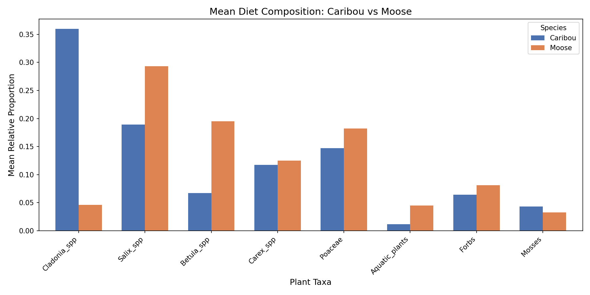
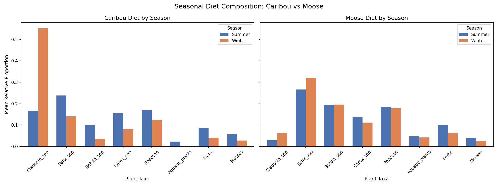
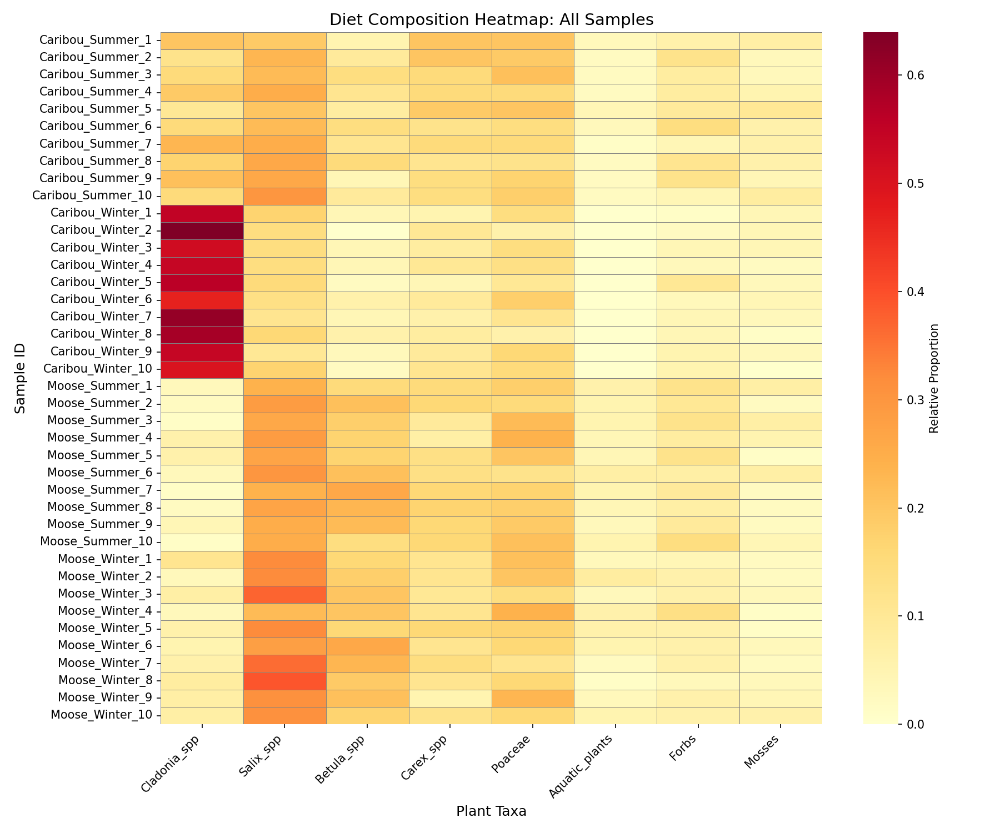
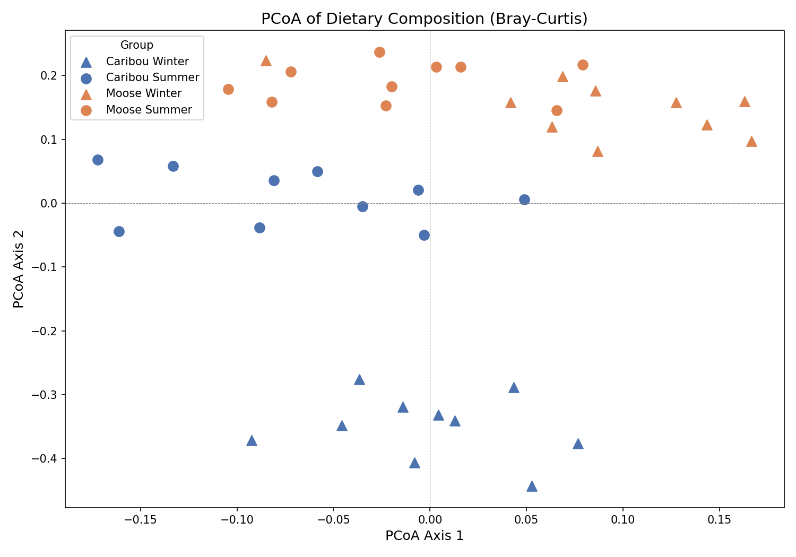

# Caribou x Moose Dietary Partitioning Analysis

A Python-based analysis exploring dietary partitioning between caribou (*Rangifer tarandus*) and moose (*Alces alces*) using simulated fecal DNA metabarcoding data. This project mimics the type of data generated from real metabarcoding studies and applies ecological analysis and visualization techniques to quantify dietary overlap and niche partitioning across species and seasons.

---

## Background

Dietary partitioning occurs when two species sharing the same habitat reduce competition by consuming different food resources. Caribou and moose co-occur across boreal and subarctic landscapes in Canada, making them an ideal system to study niche differentiation. This is particularly relevant in the context of climate change, which is altering snow cover and vegetation availability in ways that may shift dietary overlap between these species -- with potential consequences for caribou, a species at risk in Canada.

This project simulates OTU (Operational Taxonomic Unit) tables -- the standard output of plant metabarcoding pipelines -- and applies a full analysis workflow including normalization, dietary overlap quantification, and multivariate ordination.

---

## Project Structure
```
caribou-moose-diet-analysis/
├── figures/
│   ├── diet_composition.png       # Mean diet composition by species
│   ├── seasonal_comparison.png    # Diet composition split by season
│   ├── heatmap.png                # Full sample-level heatmap
│   └── pcoa.png                   # PCoA ordination plot
├── Caribou_X_Moose.py             # Main analysis script
└── README.md
```
---

## Methods

### Mock Data Generation
- 40 fecal samples simulated across two species (Caribou, Moose) and two seasons (Winter, Summer) -- 10 samples per group
- 8 plant taxa selected based on known dietary preferences from the literature
- Read counts generated using numpy.random.multinomial with biologically informed weight profiles per species and season combination
- 1000 reads simulated per sample to mimic real sequencing depth
- Random seed set to 42 for reproducibility

### Plant Taxa

Taxa                | Ecological Role
--------------------|----------------------------------
Cladonia spp.       | Lichen -- caribou winter staple
Salix spp.          | Willow -- moose browse
Betula spp.         | Birch -- moose browse
Carex spp.          | Sedge -- shared resource
Poaceae             | Grasses -- shared resource
Aquatic plants      | Moose summer resource
Forbs               | Shared resource
Mosses              | Minor resource

### Normalization
Raw read counts were normalized to relative proportions per sample so that each row sums to 1.0. This accounts for variation in sequencing depth across samples and allows meaningful comparison of dietary composition.

### Dietary Overlap -- Pianka's Index
Pianka's overlap index was calculated for four pairwise comparisons: Caribou vs Moose within each season, and Winter vs Summer within each species. The index ranges from 0 (no overlap) to 1 (identical diets).

### Ordination -- PCoA
A Bray-Curtis dissimilarity matrix was calculated across all 40 samples. Principal Coordinates Analysis (PCoA) was performed using metric MDS to project samples into 2D space, allowing visual assessment of dietary clustering by species and season.

---

## Results

### Diet Composition
Mean relative proportions per species across all seasons reveal clear dietary partitioning:
- Caribou show strong reliance on Cladonia spp. (lichens), consistent with known lichen-dominated winter diets
- Moose diet is dominated by Salix spp. (willow) and Betula spp. (birch), reflecting their browsing ecology
- Carex spp. and Poaceae show similar proportions between species, representing shared dietary resources



### Seasonal Comparison
Caribou show a dramatic seasonal shift -- lichen consumption drops from ~55% in winter to ~17% in summer as other vegetation becomes accessible. Moose diet remains highly consistent across seasons (Pianka overlap = 0.984).



### Pianka's Dietary Overlap Index

Comparison                          | Overlap Index
------------------------------------|---------------
Caribou Summer vs Moose Summer      | 0.911
Caribou Winter vs Moose Winter      | 0.463
Caribou Summer vs Caribou Winter    | 0.711
Moose Summer vs Moose Winter        | 0.984

Dietary partitioning is strongest in winter, driven by caribou specialization on lichens. Summer overlap is high, suggesting increased dietary competition when snow cover is reduced.

### Heatmap
The heatmap confirms the lichen signal visually -- Caribou Winter samples show consistently high Cladonia proportions across all 10 individuals, standing out clearly from all other groups.



### PCoA Ordination
Caribou Winter samples form a distinct cluster separated from all other groups along the primary axis, consistent with their unique lichen-dominated diet. Moose Summer and Winter samples show considerable overlap, reflecting dietary consistency across seasons.



---

## Dependencies

numpy
pandas
matplotlib
seaborn
scipy
scikit-learn

Install with:
pip install numpy pandas matplotlib seaborn scipy scikit-learn

---

## Author
Hadi | M.Sc. Bioinformatics, University of Guelph
GitHub: Draxxupaxx
